# CTF Challenge and Privilage Escalation Implementation by Veiron Vaya Yarief

# Table of Contents
- [CTF Challenge and Privilege Escalation Implementation by Veiron Vaya Yarief](#ctf-challenge-and-privilege-escalation-implementation-by-veiron-vaya-yarief)
- [Table of Contents](#table-of-contents)
  - [1. How to try](#1-how-to-try)
  - [2. About Program](#2-about-program)
    - [2.1. Configuration](#21-configuration)
      - [2.1.1. Ftp](#211-ftp)
        - [Dockerfile](#dockerfile)
        - [vsftpd.conf](#vsftpdconf)
      - [2.1.2. Http](#212-http)
        - [Dockerfile](#dockerfile-1)
      - [2.1.3. MySql](#213-mysql)
        - [init.sql](#initsql)
    - [2.1.4. Network VPN](#214-network-vpn)
      - [Lab VM (Kali-Linux) "Defender"](#lab-vm-kali-linux-defender)
      - [VM (Ubuntu-Server) "Attacker"](#vm-ubuntu-server-attacker)
      - [VM setup](#vm-setup)
    - [2.2. Write-Up/Solution](#22-write-upsolution)
    - [2.3. Privilege Escalation (Credential Hunting)](#23-privilege-escalation-credential-hunting)


## 1. How to try
- Install VirtualBox and Setup kali-linux: https://linuxsimply.com/linux-basics/os-installation/virtual-machine/kali-linux-on-virtualbox/

- If the machine dont have docker and docker compose install it first https://www.kali.org/docs/containers/installing-docker-on-kali/
- In ur desire directory run command `git clone https://github.com/VeironVaya/Vei_CTF.git`
- After that run command `cd Vei_CTF`
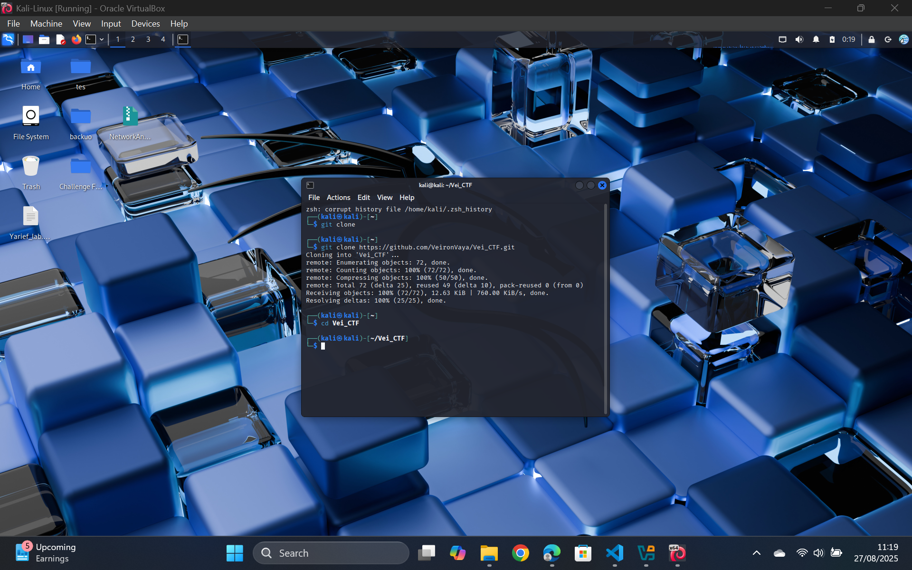  
- Run command `docker compose build`
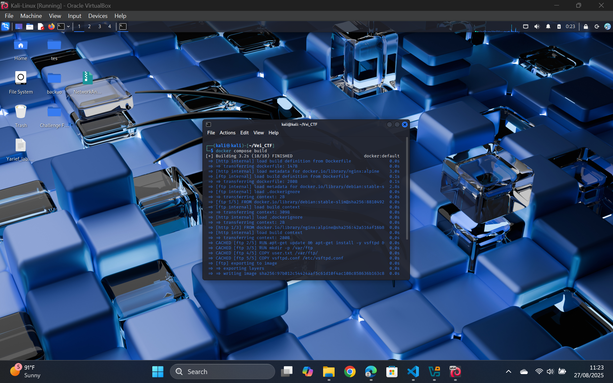  
- After it successfully built, run command `docker compose up`

- Check if the containers running using command `docker ps`
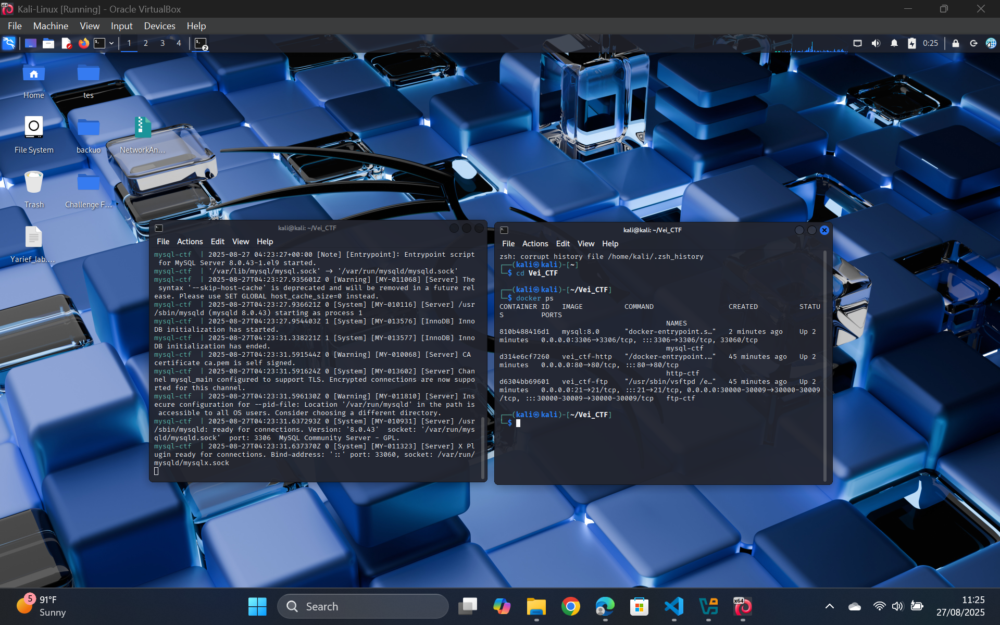
- 💻🔓 Happy HACKINGGGGGGGGG!!! 💻⚡
- 👉 Try to enumerate what is runninggg... 🚀👀


## 2. About Program

### 2.1. Configuration

#### 2.1.1. Ftp
##### Dockerfile
Purpose of this dockerfile is to build the ftp container and copy all necessary files to new directory
```Dockerfile
FROM debian:stable-slim

RUN apt-get update && apt-get install -y vsftpd && rm -rf /var/lib/apt/lists/*

RUN mkdir -p /var/ftp
COPY user.txt /var/ftp/
COPY vsftpd.conf /etc/vsftpd.conf

EXPOSE 21
CMD ["/usr/sbin/vsftpd", "/etc/vsftpd.conf"]
```


##### vsftpd.conf
Purpose of this configuration file is to tackle firewall issue with min-max port, and make it possible to exploit the anonymous login so does accesing the files

```conf
listen=YES
anonymous_enable=YES
local_enable=YES
write_enable=YES
anon_root=/var/ftp
no_anon_password=YES
hide_ids=YES

# Passive mode settings
pasv_enable=YES
pasv_min_port=30000
pasv_max_port=30009
pasv_address=127.0.0.1
```
#### 2.1.2. Http
##### Dockerfile
```Dockerfile
Purpose of this file is to make simple web app service using nginx

FROM nginx:alpine
COPY index.html /usr/share/nginx/html/index.html
COPY .hidden /usr/share/nginx/html/.hidden


```
#### 2.1.3. MySql
##### init.sql
Purpose of this sql init is to make a database and most important is to setup the user that has spesific username and password to access
```sql
CREATE DATABASE IF NOT EXISTS ctfdb;

USE ctfdb;

CREATE TABLE IF NOT EXISTS flag (
    id INT AUTO_INCREMENT PRIMARY KEY,
    flag VARCHAR(255)
);

INSERT INTO flag (flag) VALUES ('CSM{CIAqzhxRqc}');

-- create user
CREATE USER 'dausmini'@'%' IDENTIFIED BY 'passnyadausmini' REQUIRE NONE;

-- grant them access only to ctfdb
GRANT ALL PRIVILEGES ON ctfdb.* TO 'dausmini'@'%';

FLUSH PRIVILEGES;

```

### 2.1.4. Network VPN

#### Lab VM (Kali-Linux) "Defender"
This configuration is setted up in a Kali-Linux VM as the defender with 10.10.0.10 IP that can be accessible through WG's orchestrated network

```conf
[Interface]
PrivateKey = mBkZCrrSWRTi16svzMg06wwl0p4sQdp0PcAg84CVO0s=
Address = 10.10.0.10/32


[Peer]
PublicKey = LouF+35sYNUpsSA3J2SWLzMz/ZXLg+IfRXnpL/6w1TQ=
Endpoint = 34.101.37.213:51820
AllowedIPs = 10.10.0.0/24
PersistentKeepalive = 25
```
#### VM (Ubuntu-Server) "Attacker"
This configuration is setted up in a Ubunt-Server VM as the attacker with 10.10.0.11 IP that can be accessible through WG's orchestrated network
```conf
[Interface]
PrivateKey = gNmawKCTR3TW7glKmmSymh2WYXa6E1wSKCsrYH3bJ3Q=
Address = 10.10.0.11/32


[Peer]
PublicKey = LouF+35sYNUpsSA3J2SWLzMz/ZXLg+IfRXnpL/6w1TQ=
Endpoint = 34.101.37.213:51820
AllowedIPs = 10.10.0.0/24
PersistentKeepalive = 25
```

#### VM setup

On both VM according to its configuration files do:

- Run command: `sudo apt update`
- Run command: `sudo apt install wireguard resolvconf -y`
- Run command: `sudo <CONFIGURATION FILE> /etc/wireguard/<CONFIGURATION FILE>`
- Run command: `sudo chmod 600 /etc/wireguard/<CONFIGURATION FILE>`
- Run command: `sudo wg-quick up <CONFIGURATION FILE>`

### 2.2. Write-Up/Solution
- Disclaimer: change all the target ip to ur vm target ip
- Check vm ip: run command `ip a`
- General Enumeration: run command `nmap -p- 192.168.1.11` or ur vm ip
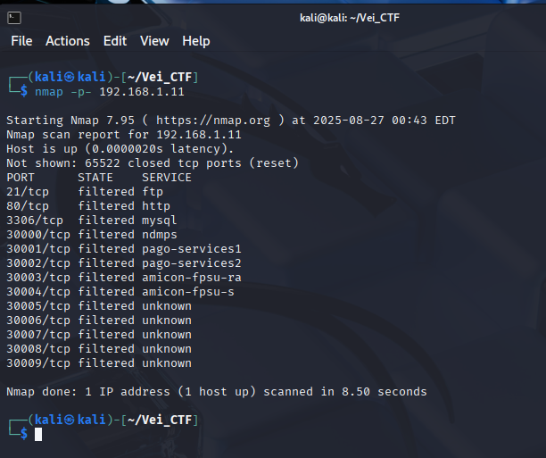
- As we can see there are three services and we will try to get information on each one
- Try anonymous login for ftp and find interesting files by following this steps
- Run command `ftp 192.168.1.11` 
- Enter **anonymous**
- Run command `ls` to see what files inside
- Run command `get user.txt`
- Run command `bye` to exit the ftp
- Run command `cat user.txt` here we get some user password that maybe usefull
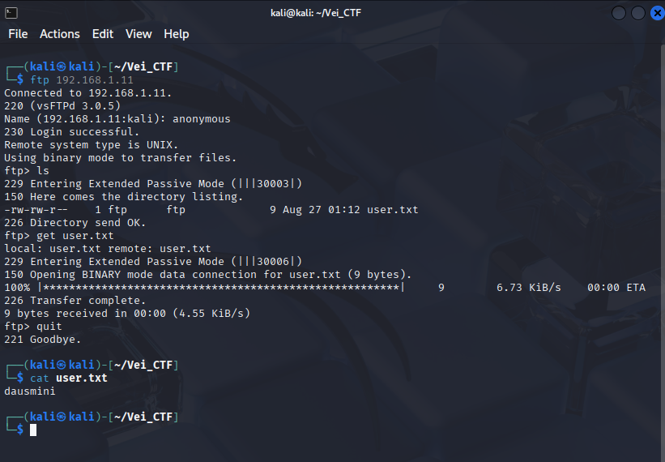
- Try finding hidden directory in http
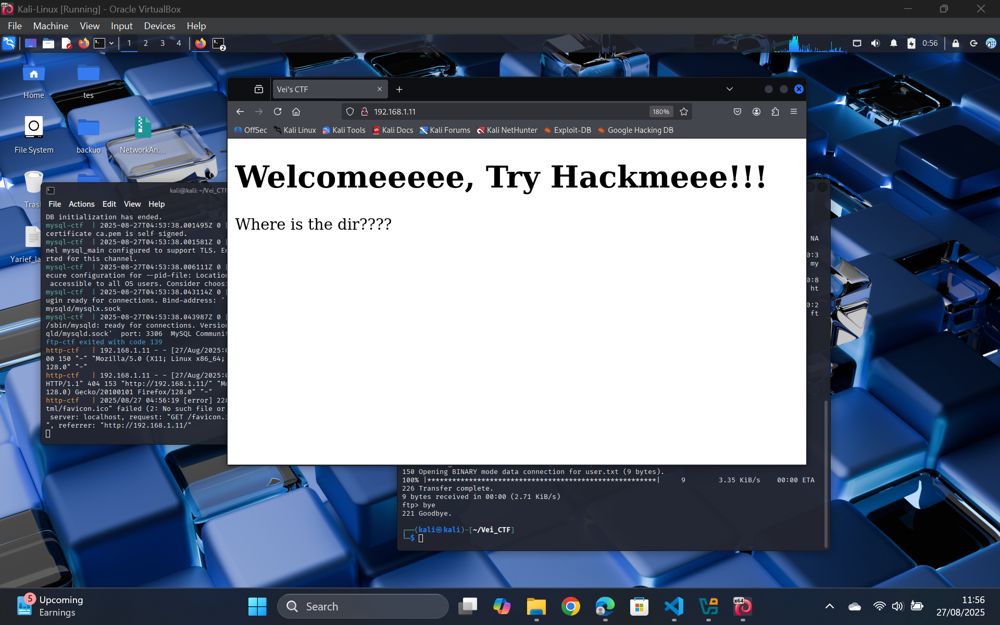
- Run command `echo -e "docker-compose.yaml\n.ftp\n.http\n.mysql\n.prefix.txt\n.readme.md\n.user.txt\n.hidden" > prefix.txt` to make all possible list of directory to bruteforced finding hidden directory
- Run command `ffuf -u http://192.168.1.11/FUZZ -w prefix.txt -mc 200,301,302,403 -t 40`
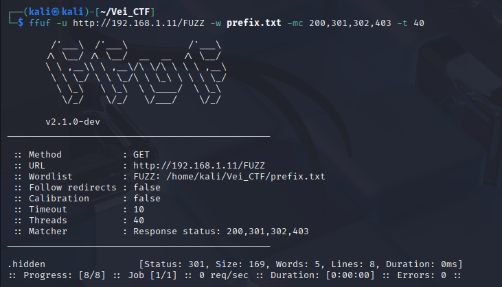
- As we can see there is a hidden directory `/.hidden`. Now we try enumerate what file could be in this directory
- Run command `echo -e "flag.txt\nflag\nsecret.txt\npass.txt\npassword.txt\nindex.html\nbackup.zip\nreadme.md\n.htaccess\n.htpasswd" > ctf.txt` to make all possible list of files 
- Run command `ffuf -u http://192.168.1.11/.hidden/FUZZ -w ctf.txt -mc 200,301,302,403`
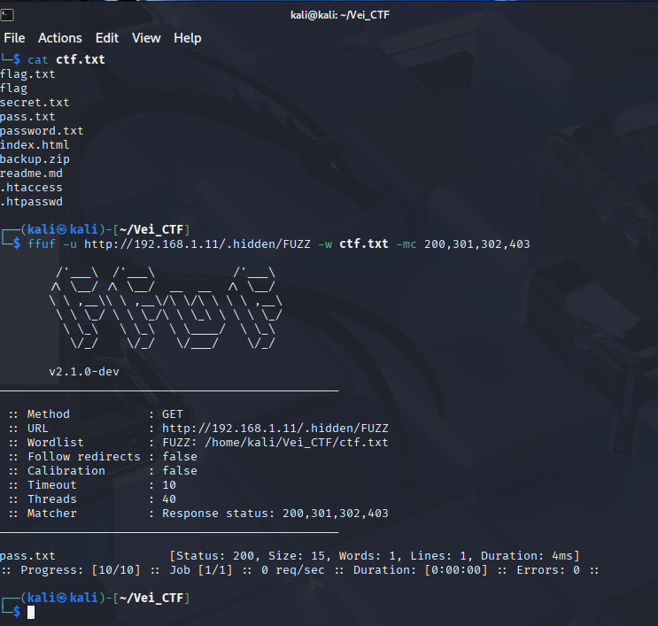
- As we can see there is a file `pass.txt`
- With this information we can check the website by going to `http://192.168.1.11/.hidden/pass.txt`
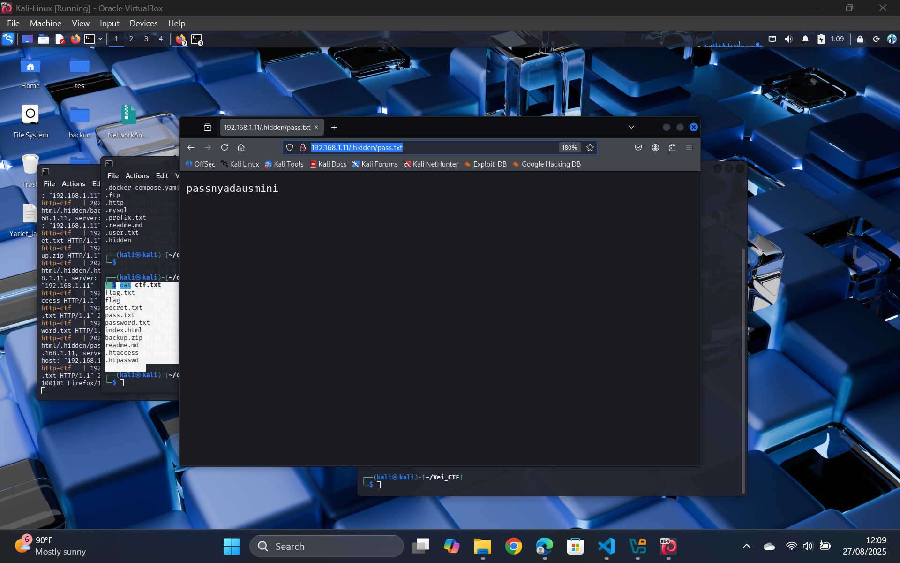
- Now with these 2 done we can try mySql service
- Run command `mysql -h 192.168.1.11 -P 3306 -u dausmini -p --skip-ssl`, we get user from the ftp steps
- Enter the `passnyadausmini` in password
- Run command `SHOW DATABASES;` to show what databases are there
- Run command `USE ctfdb;` to use the database that seems suspicious
- Run command `SHOW TABLES;` to show what data table are in the database
- Run command `SELECT * FROM flag;` to get data inside the flag table
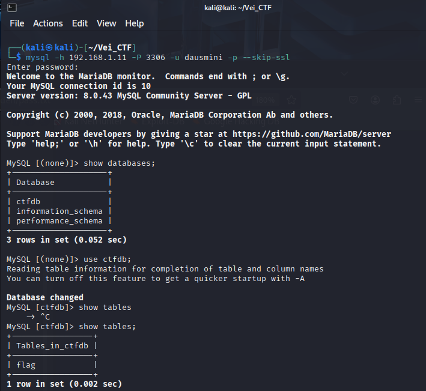
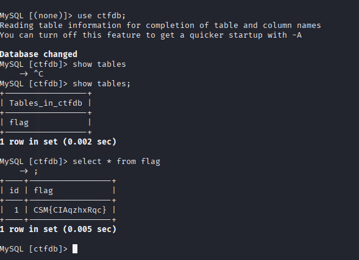
- And we get our flag
- Below is bonus documentation on simulation 2 VM
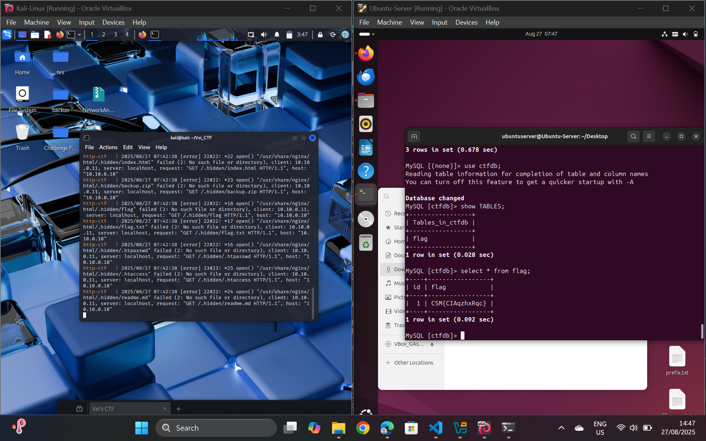
### 2.3. Privilege Escalation (Credential Hunting)

- This is what usually happened, But imagine if the directory is all accesed like vader scenario's
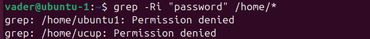

vader want to try credential hunting to find ucup's password:

- Make user ucup: can do `sudo su` to go to root: `sudo adduser ucup` > `sudo usermod -aG sudo ucup` > 
- Make user vader: can't do `sudo su`: `sudo adduser vader` > `sudo deluser vader sudo`
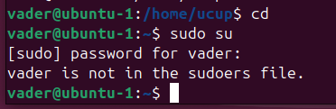
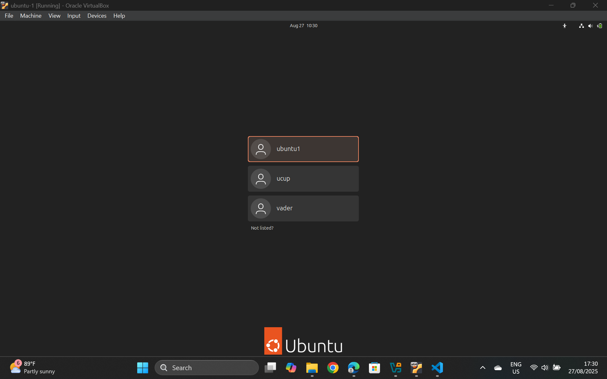
- Make All-Accessed file and directory that store ucup's password: `echo "ucup123" > /home/ucup/passworducup.txt` > `chmod 644 /home/ucup/passworducup.txt` > `sudo chmod o+r /home/ucup/passworducup.txt`
- Simulation as vader, try finding files with sensitive keyword `password` or `ucup`: `grep -Ri "ucup" /home/*`
- See the sensitive files
- Login as ucup
- Run command `sudo su`
- Now privilage escalated as root

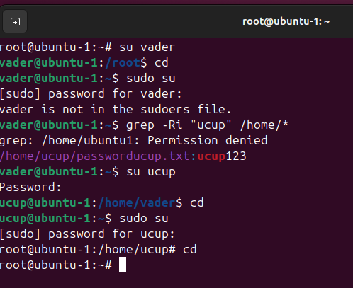
